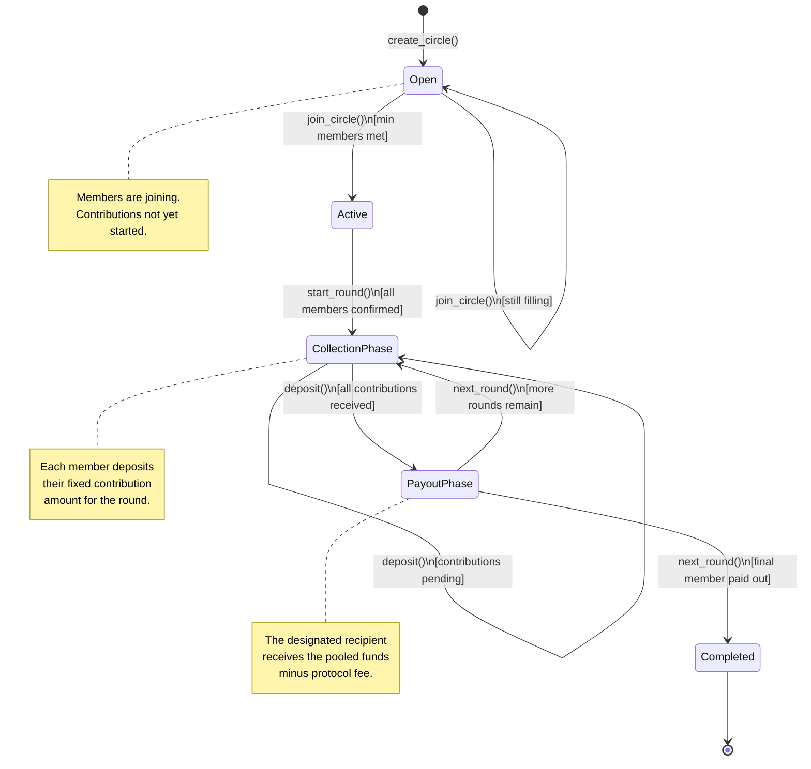

# SoroSusu Contracts

Rust smart contracts for SoroSusu: a trustless, automated Rotating Savings and Credit Association (ROSCA) built on Stellar Soroban.

---

## Savings Group Lifecycle

The diagram below shows the full lifecycle of a savings group, from creation through to final payout.



### State Descriptions

| State | Description |
|---|---|
| **Open** | The circle has been created and is accepting new members. |
| **Active** | The minimum required members have joined; the circle is confirmed and ready to begin rounds. |
| **Collection Phase** | Members are depositing their fixed contribution for the current round. |
| **Payout Phase** | All contributions are in; the pooled funds are disbursed to the round's designated recipient. |
| **Completed** | Every member has received a payout. The circle is closed. |

---

## Public Function Signatures

### Admin / Initialization

#### `initialize`
```rust
pub fn initialize(env: Env, admin: Address)
```
Initialises the contract and sets the admin address. Must be called once immediately after deployment. Subsequent calls will panic.

- `env` — Soroban environment handle  
- `admin` — Address of the protocol administrator

---

#### `set_protocol_fee`
```rust
pub fn set_protocol_fee(env: Env, fee_basis_points: u32, treasury: Address)
```
Sets the protocol fee rate and the treasury address that receives fees. Admin-only.

- `fee_basis_points` — Fee in basis points (e.g. `50` = 0.5%). Capped at `10_000` (100%).  
- `treasury` — Address that receives the collected fee. Required when `fee_basis_points > 0`.

Panics with `InvalidFeeConfig` if `fee_basis_points > 10_000` or if `fee_basis_points > 0` and `treasury` is not set.

---

### Circle Management

#### `create_circle`
```rust
pub fn create_circle(
    env: Env,
    creator: Address,
    contribution_amount: i128,
    max_members: u32,
    token: Address,
) -> u64
```
Creates a new savings circle. Returns the new `circle_id`.

- `creator` — Address of the member creating the circle  
- `contribution_amount` — Fixed amount each member must contribute per round  
- `max_members` — Maximum number of participants allowed  
- `token` — Contract address of the token used for contributions (e.g. USDC)

---

#### `join_circle`
```rust
pub fn join_circle(env: Env, member: Address, circle_id: u64)
```
Adds a member to an existing circle. The circle must be in `Open` state.

- `member` — Address of the member joining  
- `circle_id` — ID of the target circle

Panics with `CircleNotFound` if the ID is invalid, `AlreadyJoined` if the member is already part of the circle, or `Unauthorized` if the circle is no longer accepting members.

---

### Round Operations

#### `start_round`
```rust
pub fn start_round(env: Env, admin: Address, circle_id: u64)
```
Transitions the circle from `Active` into `CollectionPhase` for the first round (or advances to the next round after a payout). Admin-only.

- `admin` — Admin address (must match the stored admin)  
- `circle_id` — ID of the target circle

---

#### `deposit`
```rust
pub fn deposit(env: Env, member: Address, circle_id: u64)
```
Records a member's contribution for the current round. The member must have approved the contract to transfer at least `contribution_amount` of the circle's token before calling this function.

- `member` — Address of the depositing member  
- `circle_id` — ID of the target circle

Panics with `InsufficientAllowance` if the token allowance is too low, or `Unauthorized` if the caller is not a circle member.

> **Token approval:** Before calling `deposit`, the member must call `approve()` on the token contract, authorising this contract to spend at least `contribution_amount`.

---

#### `trigger_payout`
```rust
pub fn trigger_payout(env: Env, admin: Address, circle_id: u64)
```
Executes the payout for the current round once all contributions have been collected. Transfers `payout_amount - fee` to the designated recipient and `fee` to the treasury. Admin-only.

- `admin` — Admin address  
- `circle_id` — ID of the target circle

Panics with `CycleNotComplete` if not all members have deposited.

---

### Internal Helpers

#### `compute_and_transfer_payout`
```rust
pub fn compute_and_transfer_payout(
    env: &Env,
    token: Address,
    from: Address,
    recipient: Address,
    gross_payout: i128,
) -> i128
```
Computes the net payout after deducting the protocol fee, transfers the net amount to `recipient`, and sends the fee to the treasury. Returns the net amount transferred.

This function should be used by any custom payout logic to ensure all payouts are fee-deducted consistently.

---

### Query Functions

#### `get_circle`
```rust
pub fn get_circle(env: Env, circle_id: u64) -> Circle
```
Returns the full state of a circle by ID.

Panics with `CircleNotFound` if the ID does not exist.

---

#### `get_members`
```rust
pub fn get_members(env: Env, circle_id: u64) -> Vec<Address>
```
Returns the list of member addresses for a given circle.

---

#### `get_contribution_status`
```rust
pub fn get_contribution_status(env: Env, circle_id: u64) -> Map<Address, bool>
```
Returns a map of each member's contribution status (`true` = deposited) for the current round.

---

## Error Reference

| Code | Variant | Description |
|---|---|---|
| 1001 | `CycleNotComplete` | Payout attempted before all members have deposited |
| 1002 | `InsufficientAllowance` | Token allowance is lower than the required contribution |
| 1003 | `AlreadyJoined` | Member has already joined the circle |
| 1004 | `CircleNotFound` | No circle exists with the given ID |
| 1005 | `Unauthorized` | Caller is not permitted to perform this action |
| 1006 | `InvalidFeeConfig` | `fee_basis_points > 10,000` or treasury not set when fee > 0 |

---

## Deployed Contract

- **Network:** Stellar Mainnet  
- **Contract ID:** `CAH65U2KXQ34G7AT7QMWP6WUFYWAV6RPJRSDOB4KID6TP3OORS3BQHCX`

## Build

```bash
cargo build --target wasm32-unknown-unknown --release
```